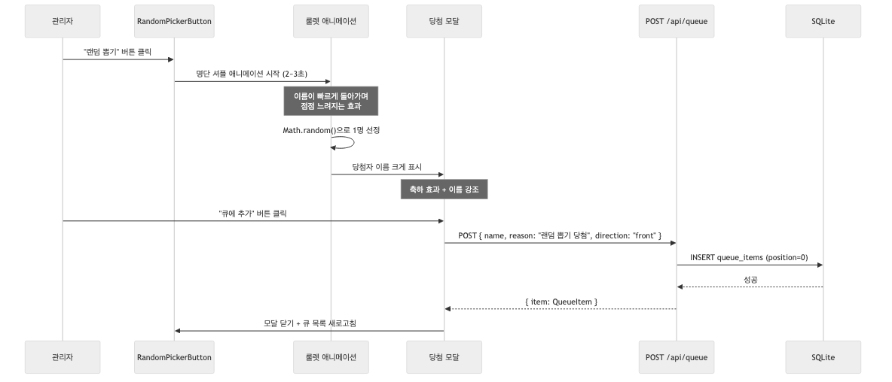

# SPEC: F9 - 랜덤 뽑기 (Random Picker)

## Purpose

고정 명단에서 랜덤으로 1명을 뽑아 큐의 맨 앞에 추가하는 기능.
긴장감을 주는 룰렛 애니메이션과 당첨자를 크게 보여주는 모달을 포함한다.

## Flow Summary

1. 관리자가 "랜덤 뽑기" 버튼 클릭
2. 고정 명단에서 이름이 빠르게 돌아가는 룰렛 애니메이션 재생 (2~3초)
3. 애니메이션이 점점 느려지며 1명에서 멈춤
4. 당첨자 이름이 크게 표시되는 모달 등장 (축하 효과)
5. "큐에 추가" 버튼 클릭 시 큐 맨 앞(front)에 추가
6. 모달 닫히고 큐 목록 새로고침

## Sequence Diagram



## 범위 정의

### In Scope
- 고정 명단 관리 (소스 코드 내 상수 배열)
- 랜덤 1명 선정 (Math.random 기반)
- 룰렛 스타일 애니메이션 (이름이 빠르게 돌다가 점점 느려짐)
- 당첨자 모달 (이름 크게 표시 + 축하 효과)
- 당첨자를 큐 맨 앞(front)에 자동 추가
- 관리자 전용 기능 (비로그인 시 버튼 숨김)
- 중복 허용 (이미 큐에 있는 사람도 다시 뽑힐 수 있음)

### Out of Scope
- 명단 DB 저장/관리 UI (고정 배열 사용)
- 명단 동적 추가/삭제 UI
- 뽑기 히스토리 저장
- 다수 동시 뽑기 (한 번에 1명만)
- 가중치/확률 조정

## Inputs / Outputs

### Inputs
- 고정 명단: `string[]` (소스 코드 내 상수)
- 관리자 인증 상태: `isAdmin`, `password` (AdminContext에서)

### Outputs
- 당첨자 이름: `string`
- 큐 추가 결과: 기존 `POST /api/queue` 응답 재사용

## 고정 명단

```typescript
// src/constants/members.ts
export const MEMBERS: string[] = [
  // 관리자가 제공하는 명단으로 채움
  // 예: "김철수", "이영희", "박민수", ...
];
```

명단 변경 시 소스 코드 수정 후 재배포.

## UI Components

### RandomPickerButton
- **위치**: EnqueueForm 하단 또는 별도 섹션
- **조건**: `isAdmin === true`일 때만 표시
- **외형**: 보라색 계열 그라디언트, 기존 UI 톤 통일
- **텍스트**: "🎲 랜덤 뽑기"
- **클릭 시**: 룰렛 애니메이션 시작

### RandomPickerAnimation (룰렛)
- **전체 화면 오버레이** (z-50, 반투명 배경)
- **중앙 카드**: 이름이 빠르게 바뀌며 표시
- **동작 흐름**:
  1. 처음 1초: 매우 빠르게 이름 순환 (50ms 간격)
  2. 중간 1초: 점점 느려짐 (100ms → 200ms → 400ms)
  3. 마지막: 최종 당첨자에서 멈춤
- **총 시간**: 약 2~3초
- **시각 효과**: 현재 이름 텍스트 크기 크게, 배경색 변화

### RandomPickerResultModal (당첨 모달)
- **전체 화면 오버레이** (z-50)
- **중앙 모달 카드** (max-w-md, 흰색 배경, 둥근 모서리)
- **내용**:
  - 상단: "🎉 당첨!" 텍스트
  - 중앙: 당첨자 이름 (text-4xl 이상, 보라색, bold)
  - 하단 버튼:
    - "큐에 추가" (보라색 그라디언트, primary)
    - "다시 뽑기" (회색, secondary)
    - "닫기" (텍스트 버튼)
- **진입 애니메이션**: scale-up + fade-in

## Behavior Rules

| 규칙 | 설명 |
|------|------|
| BR-1 | 관리자만 랜덤 뽑기 버튼이 표시됨 |
| BR-2 | 명단은 소스 코드 내 고정 배열 |
| BR-3 | 뽑기 결과는 항상 큐 맨 앞(front)에 추가 |
| BR-4 | 큐 추가 시 reason은 "랜덤 뽑기 당첨"으로 자동 설정 |
| BR-5 | 중복 허용: 이미 큐에 있는 사람도 다시 뽑힐 수 있음 |
| BR-6 | 애니메이션 도중 취소 불가 (시작하면 끝까지 재생) |
| BR-7 | "다시 뽑기" 클릭 시 큐 추가 없이 애니메이션 재시작 |
| BR-8 | "큐에 추가" 성공 후 모달 닫히고 큐 목록 새로고침 |
| BR-9 | 기존 POST /api/queue API 재사용 (새 엔드포인트 불필요) |

## Edge Cases

| 케이스 | 처리 |
|--------|------|
| 명단이 1명뿐 | 애니메이션 후 해당 1명 표시 (정상 동작) |
| 명단이 비어있음 | 버튼 비활성화 + "명단이 비어있습니다" 툴팁 |
| 큐 추가 API 실패 | 모달에 에러 메시지 표시, 재시도 가능 |
| 애니메이션 중 페이지 이탈 | 자연스럽게 중단 (cleanup) |
| 동시에 여러 번 클릭 | 애니메이션 진행 중 버튼 비활성화로 방지 |

## Error Handling

| 에러 상황 | 처리 방법 |
|-----------|-----------|
| POST /api/queue 401 | "관리자 인증이 필요합니다" 표시 |
| POST /api/queue 500 | "추가에 실패했습니다. 다시 시도해주세요." 표시 |
| 네트워크 에러 | "네트워크 오류가 발생했습니다." 표시 |
| 명단 비어있음 | 버튼 자체를 disabled 처리 |

## 신규 파일

| 파일 | 설명 |
|------|------|
| `src/constants/members.ts` | 고정 명단 상수 배열 |
| `src/components/Queue/RandomPicker.tsx` | 랜덤 뽑기 버튼 + 애니메이션 + 결과 모달 통합 컴포넌트 |

## 수정 파일

| 파일 | 변경 내용 |
|------|-----------|
| `src/app/page.tsx` | RandomPicker 컴포넌트 추가 |

## Test Strategy

- T1: 명단이 비어있을 때 버튼 disabled 상태 확인
- T2: 비관리자일 때 랜덤 뽑기 버튼 미표시 확인
- T3: 랜덤 뽑기 결과가 명단 내 이름인지 확인
- T4: "큐에 추가" 클릭 시 POST /api/queue 호출 확인 (direction: "front")
- T5: "다시 뽑기" 클릭 시 애니메이션 재시작 확인
- T6: API 에러 시 에러 메시지 표시 확인
- T7: npm run build 성공
