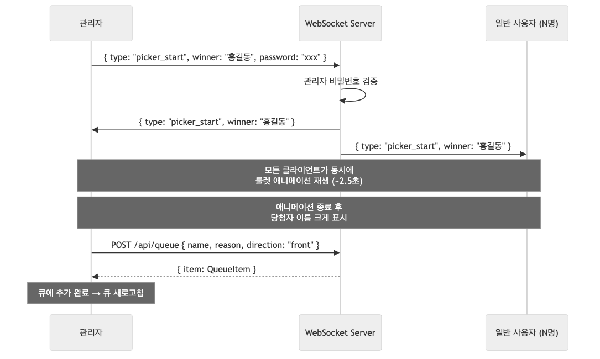

# SPEC: F9 - 랜덤 뽑기 (Random Picker)

## Purpose

고정 명단에서 랜덤으로 1명을 뽑아 큐의 맨 앞에 추가하는 기능.
긴장감을 주는 룰렛 애니메이션과 당첨자를 크게 보여주는 모달을 포함한다.

**v2 추가**: 관리자가 랜덤 뽑기를 시작하면, 메인 큐 페이지에 접속한 **모든 사용자**가
WebSocket을 통해 동시에 같은 룰렛 애니메이션과 당첨 결과를 볼 수 있다.

## Flow Summary

### 관리자 흐름
1. 관리자가 "랜덤 뽑기" 버튼 클릭
2. 클라이언트에서 당첨자를 미리 선정
3. WebSocket으로 `{ type: "picker_start", winner }` 메시지를 서버에 전송
4. 서버가 관리자 비밀번호를 검증한 뒤 모든 클라이언트에 broadcast
5. 모든 클라이언트가 동시에 룰렛 애니메이션 재생 (~2.5초)
6. 애니메이션 종료 후 당첨자 이름이 크게 표시되는 모달 등장
7. **관리자만** "큐에 추가" / "다시 뽑기" / "닫기" 버튼 표시
8. "큐에 추가" 클릭 시 큐 맨 앞(front)에 추가, 모달 닫힘

### 일반 사용자 흐름
1. 메인 큐 페이지(/)에 접속 중
2. WebSocket으로 `picker_start` 메시지 수신
3. 자동으로 룰렛 애니메이션 + 당첨 결과 모달 표시
4. "큐에 추가" 버튼 없이 **결과만** 확인
5. 관리자가 모달을 닫으면 `picker_end` 메시지 수신 → 모달 자동 닫힘

## Sequence Diagrams

### 로컬 흐름 (v1)


### 브로드캐스트 흐름 (v2)


## 범위 정의

### In Scope
- 고정 명단 관리 (소스 코드 내 상수 배열)
- 랜덤 1명 선정 (Math.random 기반, 관리자 클라이언트에서 결정)
- 룰렛 스타일 애니메이션 (이름이 빠르게 돌다가 점점 느려짐)
- 당첨자 모달 (이름 크게 표시 + 축하 효과)
- 당첨자를 큐 맨 앞(front)에 자동 추가
- 관리자 전용: 뽑기 시작 버튼 + 큐에 추가 버튼
- 일반 사용자: 애니메이션 + 결과 모달 관람만 가능
- **WebSocket broadcast**: 모든 접속자가 동시에 애니메이션 시청
- 중복 허용 (이미 큐에 있는 사람도 다시 뽑힐 수 있음)

### Out of Scope
- 명단 DB 저장/관리 UI (고정 배열 사용)
- 명단 동적 추가/삭제 UI
- 뽑기 히스토리 저장
- 다수 동시 뽑기 (한 번에 1명만)
- 가중치/확률 조정
- 큐 페이지 외 다른 페이지에서의 애니메이션 표시

## Inputs / Outputs

### Inputs
- 고정 명단: `string[]` (소스 코드 내 상수)
- 관리자 인증 상태: `isAdmin`, `password` (AdminContext에서)
- WebSocket 연결: 메인 큐 페이지에서 `/ws` 경로로 연결

### Outputs
- 당첨자 이름: `string`
- 큐 추가 결과: 기존 `POST /api/queue` 응답 재사용
- WebSocket 메시지: `picker_start`, `picker_end`

## 고정 명단

```typescript
// src/constants/members.ts (구현 완료)
export const MEMBERS: string[] = [
  '고경우', '고용훈', '권희철', '김동연', '김민지', '김수환', '김예린',
  '박교녕', '서승준', '서현원', '성승재', '송정기', '유채은', '이규섭',
  '이보윤', '이정인', '이정현', '장현준', '전진', '정민호', '정보경',
  '조인후', '채원찬', '최동준',
];
```

## WebSocket Protocol

### 메시지 타입

| 방향 | Type | 필드 | 설명 |
|------|------|------|------|
| Client → Server | `picker_start` | `{ type, winner, password }` | 관리자가 뽑기 시작 요청 |
| Server → All Clients | `picker_start` | `{ type, winner }` | 모든 클라이언트에 뽑기 시작 broadcast |
| Client → Server | `picker_end` | `{ type, password }` | 관리자가 모달 닫기 요청 |
| Server → All Clients | `picker_end` | `{ type }` | 모든 클라이언트에 모달 닫기 broadcast |

### 서버 처리 로직

```
picker_start 수신:
  1. password 검증 (verifyPassword)
  2. 실패 시 → 해당 클라이언트에만 { type: "picker_error", message: "관리자 인증 실패" }
  3. 성공 시 → 모든 클라이언트에 { type: "picker_start", winner } broadcast

picker_end 수신:
  1. password 검증
  2. 성공 시 → 모든 클라이언트에 { type: "picker_end" } broadcast
```

## UI Components

### RandomPickerButton (관리자 전용)
- **위치**: EnqueueForm 상단, 별도 카드 섹션
- **조건**: `isAdmin === true`일 때만 표시
- **외형**: amber→orange 그라디언트, 기존 UI 톤 통일
- **텍스트**: "🎲 랜덤 뽑기"
- **클릭 시**: 당첨자 선정 후 WebSocket으로 `picker_start` 전송

### RandomPickerAnimation (룰렛) - 모든 사용자
- **전체 화면 오버레이** (z-50, 반투명 배경)
- **중앙 카드**: 이름이 빠르게 바뀌며 표시
- **동작 흐름**:
  1. 처음 1초: 매우 빠르게 이름 순환 (50ms 간격)
  2. 중간 1초: 점점 느려짐 (100ms → 200ms → 400ms)
  3. 마지막: 최종 당첨자에서 멈춤
- **총 시간**: 약 2~3초
- **시각 효과**: 현재 이름 텍스트 크기 크게, 배경색 변화
- **트리거**: WebSocket `picker_start` 메시지 수신 시

### RandomPickerResultModal (당첨 모달) - 모든 사용자
- **전체 화면 오버레이** (z-50)
- **중앙 모달 카드** (max-w-md, 흰색 배경, 둥근 모서리)
- **내용**:
  - 상단: "🎉 당첨!" 텍스트
  - 중앙: 당첨자 이름 (text-5xl, 보라색, bold)
  - 하단 버튼 **(관리자만)**:
    - "큐에 추가" (보라색 그라디언트, primary)
    - "다시 뽑기" (회색, secondary)
    - "닫기" (텍스트 버튼)
  - 하단 텍스트 **(일반 사용자)**:
    - "관리자가 결과를 처리 중입니다..." 안내 문구
- **진입 애니메이션**: scale-up + fade-in
- **닫힘**: 관리자가 닫기/큐추가 시 `picker_end` broadcast → 모든 클라이언트 자동 닫힘

## Behavior Rules

| 규칙 | 설명 |
|------|------|
| BR-1 | 관리자만 랜덤 뽑기 버튼이 표시됨 |
| BR-2 | 명단은 소스 코드 내 고정 배열 |
| BR-3 | 뽑기 결과는 항상 큐 맨 앞(front)에 추가 |
| BR-4 | 큐 추가 시 reason은 "랜덤 뽑기 당첨"으로 자동 설정 |
| BR-5 | 중복 허용: 이미 큐에 있는 사람도 다시 뽑힐 수 있음 |
| BR-6 | 애니메이션 도중 취소 불가 (시작하면 끝까지 재생) |
| BR-7 | "다시 뽑기" 클릭 시 새로운 picker_start broadcast 발생 |
| BR-8 | "큐에 추가" 성공 후 picker_end broadcast + 큐 목록 새로고침 |
| BR-9 | 기존 POST /api/queue API 재사용 (새 엔드포인트 불필요) |
| BR-10 | 관리자가 뽑기 시작 시 WebSocket으로 모든 클라이언트에 broadcast |
| BR-11 | 일반 사용자는 애니메이션과 결과만 관람 (큐 추가 버튼 없음) |
| BR-12 | 관리자가 모달을 닫으면 모든 클라이언트의 모달도 자동으로 닫힘 |
| BR-13 | 메인 큐 페이지(/)에서 WebSocket 연결 유지 (기존 /ws 경로 재사용) |

## Edge Cases

| 케이스 | 처리 |
|--------|------|
| 명단이 1명뿐 | 애니메이션 후 해당 1명 표시 (정상 동작) |
| 명단이 비어있음 | 버튼 비활성화 |
| 큐 추가 API 실패 | 모달에 에러 메시지 표시, 재시도 가능 |
| 애니메이션 중 페이지 이탈 | 자연스럽게 중단 (cleanup) |
| 동시에 여러 번 클릭 | 애니메이션 진행 중 버튼 비활성화로 방지 |
| WebSocket 미연결 상태 | 관리자 로컬에서만 동작 (graceful degradation) |
| 일반 사용자가 picker_start 직접 전송 시도 | 서버에서 password 검증 → 실패 시 무시 |
| 관리자가 페이지 이탈 후 일반 사용자 모달 열려있음 | 30초 타임아웃으로 자동 닫힘 |

## Error Handling

| 에러 상황 | 처리 방법 |
|-----------|-----------|
| POST /api/queue 401 | "관리자 인증이 필요합니다" 표시 |
| POST /api/queue 500 | "추가에 실패했습니다. 다시 시도해주세요." 표시 |
| 네트워크 에러 | "네트워크 오류가 발생했습니다." 표시 |
| 명단 비어있음 | 버튼 자체를 disabled 처리 |
| WebSocket 인증 실패 | picker_error 메시지로 관리자에게 알림 |
| WebSocket 연결 끊김 | 3초 후 자동 재연결 (기존 패턴) |

## 수정 파일

| 파일 | 변경 내용 |
|------|-----------|
| `server.ts` | `picker_start`, `picker_end` 메시지 핸들러 추가 + password 검증 |
| `src/components/Queue/RandomPicker.tsx` | WebSocket 연동: 뽑기 시작 시 broadcast, 수신 시 애니메이션, 관리자/일반 사용자 UI 분리 |
| `src/app/page.tsx` | WebSocket 연결 추가 + RandomPicker에 ws ref 전달 |

## Test Strategy

- T1: 명단이 비어있을 때 버튼 disabled 상태 확인
- T2: 비관리자일 때 랜덤 뽑기 버튼 미표시 확인
- T3: 랜덤 뽑기 결과가 명단 내 이름인지 확인
- T4: "큐에 추가" 클릭 시 POST /api/queue 호출 확인 (direction: "front")
- T5: "다시 뽑기" 클릭 시 새로운 picker_start broadcast 확인
- T6: API 에러 시 에러 메시지 표시 확인
- T7: 서버에서 picker_start 수신 시 password 검증 확인
- T8: picker_start broadcast 시 winner 포함 확인
- T9: 일반 사용자 모달에 "큐에 추가" 버튼 미표시 확인
- T10: picker_end broadcast 시 모든 클라이언트 모달 닫힘 확인
- T11: npm run build 성공
