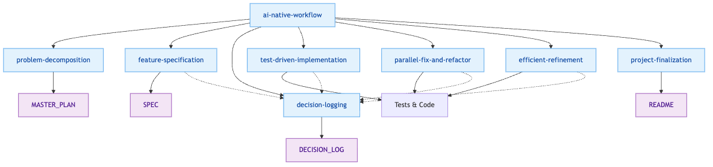
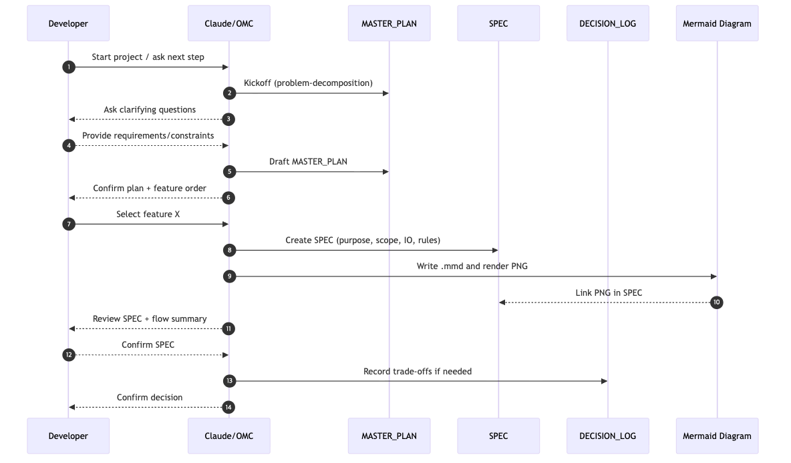
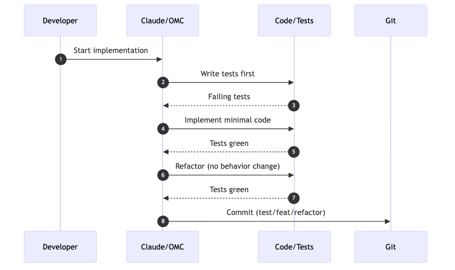

# 🧑‍💻 AI_NATIVE_DEV.md

## ✏️ Summary

---

본 프로젝트는 AI-Native 개발 프로세스를 기반으로 진행되며, AI를 단순한 코드 생성 도구가 아니라 개발 워크플로우의 구성원(Agent)으로 통합하여 사용한다.
 - [`Claude Code`](https://claude.com/product/claude-code)와 [`oh-my-claudecode`](https://github.com/Yeachan-Heo/oh-my-claudecode)(omc)를 통해 문제 분석(계획 수립), 기능 단위 스펙 정의, 기술적 의사결정 기록, TDD 기반 구현, 리팩토링/오류 복구, 최종 문서화까지 전 과정을 단계화하였다. 
  - 개발자는 각 단계에서 AI와 토론하며 대안을 비교하고 트레이드오프를 선택하며, 그 근거를 **MASTER_PLAN** / **SPEC** / **DECISION_LOG** 문서로 지속적으로 남긴다. 
  - 각 단계는 개별 **SKILL**로 정의되고, 상위 오케스트레이터인 **ai-native-workflow**가 다음 스텝을 추천한다.

## 🧵 Orchestration



### [`ai-native-workflow`] - 오케스트레이션(진행 매니저) SKILL

<details>
<summary>SKILL.md (<u><em>CLICK</em></u>)</summary>

```markdown
---
name: ai-native-workflow
description: Progress manager that detects current stage and recommends exactly one next sub-skill; situational actions are condition-gated.
---

## Role
Orchestrate the workflow by recommending exactly ONE next sub-skill and a checklist.
Do not implement large code; delegate deep work to sub-skills.
Situational skills must be triggered only when conditions are met.

## Detect Stage (by artifacts + developer intent)
- If MASTER_PLAN missing/incomplete → Kickoff
- If feature chosen but SPEC missing/incomplete → Spec
- If a technical choice/trade-off exists → Decision
- If SPEC ready and building feature → Implement (TDD)
- If many failures/broken state → Recovery (situational)
- If tests green and cleanup/perf requested → Refinement (situational)
- If features done and packaging/docs needed → Finalize

## Next Step Mapping (recommend ONE)
- Kickoff → problem-decomposition
- Spec → feature-specification {feature_name}
- Decision → decision-logging {feature_name}
- Implement → test-driven-implementation {feature_name}
- Recovery (only if many failures) → parallel-fix-and-refactor {feature_name}
- Refinement (only if green + cleanup) → efficient-refinement {feature_name}
- Finalize → project-finalization

## Document Locations (canonical)
- `.claude/docs/MASTER_PLAN.md`
- `.claude/docs/features/{feature_name}/SPEC.md`
- `.claude/docs/features/{feature_name}/DECISION_LOG.md`
- `.claude/docs/WORKFLOW.md`

## Template Bootstrap (optional checklist)
1. Run `/Users/seoseungjun/.omc/skills/.templates/init-templates.sh` at the project root
2. Or copy `/Users/seoseungjun/.omc/skills/.templates/WORKFLOW.md` → `.claude/docs/WORKFLOW.md`
3. Copy `/Users/seoseungjun/.omc/skills/.templates/MASTER_PLAN.md` → `.claude/docs/MASTER_PLAN.md`
4. For each feature, copy `/Users/seoseungjun/.omc/skills/.templates/SPEC.md` → `.claude/docs/features/{feature_name}/SPEC.md`
5. For each feature, copy `/Users/seoseungjun/.omc/skills/.templates/DECISION_LOG.md` → `.claude/docs/features/{feature_name}/DECISION_LOG.md`
6. Ensure `.claude/docs/features/` exists before copying

## Output (always this format)
1) Current Stage (1-2 bullets)
2) Next Step (sub-skill name)
3) Checklist (5-10 items)
4) Conditional Actions
   - parallel-fix-and-refactor: only if many tests fail / broken state
   - efficient-refinement: only if tests green + cleanup/perf requested
5) Artifacts to update (docs/files)

## Preflight Checks (when starting a project)
- Confirm skill folder is loaded (global or project-local).
- Verify templates are up to date in `.claude/docs`.
- Verify Mermaid PNG pipeline: `.claude/docs/tools/puppeteer-config.json` exists and `mmdc` can render.
```

</details>


## 📁 Documents

---

| Document | Location | Purpose |
| --- | --- | --- |
| `README.md` | project root | 프로젝트 개요/실행법/문서 링크/검증 방법 제공 |
| `CLAUDE.md` | project root | AI 협업 규칙·제약·응답 방식 |
| `WORKFLOW.md` | `.claude/docs/WORKFLOW.md` | 개발 프로세스 매뉴얼 |
| `MASTER_PLAN.md` | `.claude/docs/MASTER_PLAN.md` | 요구사항 분해/우선순위/작업 순서 로드맵 |
| `SPEC.md` | `.claude/docs/features/{feature}/SPEC.md` | 기능 명세(입출력/규칙/엣지/테스트 전략) |
| `DECISION_LOG.md` | `.claude/docs/features/{feature}/DECISION_LOG.md` | 기술 선택/트레이드오프 기록 |
| `ADR` (optional) | `.claude/docs/adr/` | 프로젝트 전역 설계 결정 모음 |


## 💼 Workflow

---

## Phase 1: Plan/Spec/Decision



### [`problem-decomposition`] - 문제 분석 & 기능 분해 & 작업 순서 확정 SKILL


- 진행내용 : 요구사항을 분석하고 모호한 지점을 가정/제약으로 정리한다. 구현 가능한 small feature로 분해하고 기능 간 의존성과 우선순위를 정해 전체 작업 순서를 합의한다.
  
    

- omc-mode : plan → ralplan
- 산출물 :
    - `.claude/docs/MASTER_PLAN.md`

<details>
<summary>problem-decomposition/SKILL.md (<u><em>CLICK</em></u>)</summary>

```markdown
    ---
    name: problem-decomposition
    description: Analyze the problem, surface ambiguities, and produce an executable feature plan and order in MASTER_PLAN.md.
    ---
    
    ## Goal
    - Interpret requirements, identify missing/ambiguous points, and agree on assumptions.
    - Decompose into small implementable features with dependencies and execution order.
    
    ## When to use
    - At the start of a new project/task.
    - When requirements are incomplete or unclear.
    
    ## Process
    1. Summarize the problem in plain language.
    2. Ask the developer targeted questions to validate assumptions and inputs.
    3. List ambiguities and propose explicit assumptions.
    4. Identify constraints (tech, time, performance, correctness).
    5. Decompose into small features (each implementable independently).
    6. Define dependencies and an execution order.
    7. Confirm the plan with the developer.
    
    ## Output
    Create/update:
    - `.claude/docs/MASTER_PLAN.md`
    
    ## MASTER_PLAN.md template
    - Problem summary
    - Assumptions & open questions
    - Constraints
    - Feature list (small features)
    - Execution order & dependencies
    - Non-goals / deferred items
    
```

</details> 

### [`feature-specification`] - Feature 스펙 확정 SKILL

- 진행내용 : 착수할 feature의 목적/범위, 입력·출력, 동작 규칙, 엣지 케이스, 테스트 전략을 “구현 가능한 수준”으로 구체화해 스펙을 확정한다.
  
    

- omc-mode : ralplan
- 산출물 :
    - `.claude/docs/features/{feature_name}/SPEC.md`

<details>
<summary>feature-specification/SKILL.md (<u><em>CLICK</em></u>)</summary>

```markdown
    ---
    name: feature-specification
    description: Create a concrete, testable SPEC.md for a single feature (scope, behavior, edge cases, tests).
    ---
    
    ## Goal
    - Make a single feature implementable by defining scope, behavior, and tests.
    
    ## When to use
    - Before starting implementation of a feature.
    - When feature scope or behavior needs to be pinned down.
    
    ## Inputs
    - Feature name: `{feature_name}`
    - Context: `.claude/docs/MASTER_PLAN.md` (if present)
    
    ## Process
    1. Define the feature purpose and boundaries.
    2. Specify inputs/outputs and validation rules.
    3. Define behavior rules and edge cases.
    4. Define error handling policy.
    5. Define test strategy (unit/policy/fixture/integration).
    6. If a design/behavior trade-off appears, pause SPEC and update DECISION_LOG.
    7. Add a sequence diagram section right after Purpose, and include a brief “flow summary” list.
    8. Prefer sequence diagrams over code snippets; keep SPEC code minimal.
    9. Mermaid rendering procedure:
       - Create `.mmd` under `.claude/docs/features/{feature_name}/assets/`
       - Render to `.png` with `mmdc -p .claude/docs/tools/puppeteer-config.json -i <diagram.mmd> -o <diagram.png>`
       - Use relative image links in SPEC: ``
    10. Use the SPEC section name “범위 정의” (include/exclude).
    
    ## Output
    Create/update:
    - `.claude/docs/features/{feature_name}/SPEC.md`
    
    ## SPEC.md template
    - Purpose
    - Scope (in/out)
    - Inputs/Outputs
    - Behavior rules
    - Edge cases
    - Error handling
    - Test strategy
    
```

</details> 

### [`decision-logging`] - 기술적 의사결정 & 트레이드오프 기록 SKILL

- 진행내용 : 기술 선택이 필요한 지점에서 대안들을 정리하고, 최종 선택/포기 이유/트레이드오프를 문서화한다. 구현 중 판단이 추가되거나 변경되면 지속적으로 업데이트한다.
  
    

- omc-mode : ralph
- 산출물 :
    - `.claude/docs/features/{feature_name}/DECISION_LOG.md`

<details>
<summary>decision-logging/SKILL.md (<u><em>CLICK</em></u>)</summary>

```markdown
    ---
    name: decision-logging
    description: Record technical decisions with alternatives and trade-offs in DECISION_LOG.md for a feature.
    ---
    
    ## Goal
    - Make technical decisions explainable and traceable (why this, not that).
    
    ## When to use
    - When selecting between approaches (data structures, parsing strategy, architecture, error policy).
    - When changing direction during implementation.
    
    ## Inputs
    - Feature name: `{feature_name}`
    - Decision topic and context
    
    ## Process
    1. State the decision point and context.
    2. List options considered (A/B/…).
    3. Compare trade-offs (complexity, correctness, performance, maintainability).
    4. Record the final decision and rationale.
    5. Add “revisit conditions” if applicable.
    6. Prefer short narrative paragraphs over bullet-only lists.
    
    ## Output
    Create/update:
    - `.claude/docs/features/{feature_name}/DECISION_LOG.md`
    
    ## DECISION_LOG.md template
    - Date / Title
    - Context
    - Options considered
    - Decision
    - Rationale (trade-offs)
    - Revisit conditions
    
```

</details> 

## Phase 2: Implement



### [`test-driven-implementation`] - TDD 기반 구현 & 작은 단위 커밋 SKILL


- 진행내용 : SPEC/DECISION_LOG를 기준으로 테스트를 먼저 작성하고(테스트→구현→리팩토링), 테스트 통과를 기준으로 기능을 완성한다. 구현 중 새로운 판단이 발생하면 3단계로 회귀해 기록 후 진행한다. 커밋은 테스트 추가/통과/버그 수정/리팩토링 등 작은 단위로 수시 수행한다.
  
    

- omc-mode : ralph
- 산출물 :
    - 테스트 코드 `src/test/...`
    - 구현 코드 `src/main/...`
    - (수시 갱신) `.claude/docs/features/{feature_name}/DECISION_LOG.md`
    - Git commit history(작은 단위 커밋)

<details>
<summary>test-driven-implementation/SKILL.md (<u><em>CLICK</em></u>)</summary>

```markdown
    ---
    name: test-driven-implementation
    description: Implement a feature via TDD using SPEC.md and DECISION_LOG.md as the source of truth.
    ---
    
    ## Goal
    - Build the feature safely: test → implement → refactor, aligned with spec and decisions.
    
    ## When to use
    - During feature implementation.
    
    ## Inputs
    - `.claude/docs/features/{feature_name}/SPEC.md`
    - `.claude/docs/features/{feature_name}/DECISION_LOG.md` (if present)
    
    ## Process
    1. Derive test cases from SPEC (happy paths + edge cases).
    2. Write tests first (unit/policy/fixture/integration as planned).
    3. Implement minimal code to pass tests.
    4. Refactor while keeping tests green.
    5. If a new decision arises, pause and update DECISION_LOG (use decision-logging SKILL).
    6. Commit in small increments:
       - tests added
       - implementation added
       - bug fix
       - refactor
    
    ## Output
    - Production code under `src/main/...`
    - Test code under `src/test/...`
    - Updated DECISION_LOG if new decisions were made
    
```

</details>

### [`parallel-fix-and-refactor`] - 다수 오류/테스트 실패 병렬 복구 (선택) SKILL


- 진행내용 : 여러 테스트가 동시에 깨지거나 수정 포인트가 많을 때 빠르게 정상 상태로 복구한다. 실패 테스트를 병렬로 해결하고 명백한 리팩토링을 정리하되, 스펙 변경이나 새로운 설계 결정을 만들지 않는다(필요 시 3단계에서 먼저 결정).
  
    

- omc-mode : ulw
- 산출물 :
    - 수정된 테스트/구현 코드
    - (필요 시) `.claude/docs/features/{feature_name}/DECISION_LOG.md` 업데이트
    - Git commit history(복구 단위 커밋)

<details>
<summary>parallel-fix-and-refactor/SKILL.md (<u><em>CLICK</em></u>)</summary>

```markdown
    ---
    name: parallel-fix-and-refactor
    description: Fix multiple failing tests or obvious issues quickly without changing spec or introducing new design decisions.
    ---
    
    ## Goal
    - Recover a broken state fast when many errors/tests fail.
    
    ## When to use
    - Multiple tests are failing.
    - Many small fixes are needed across files.
    
    ## Rules
    - Do NOT change the feature scope/spec.
    - Do NOT introduce new design decisions.
    - If spec/design changes are needed, stop and use decision-logging first.
    
    ## Process
    1. Group failures by root cause.
    2. Apply minimal fixes to restore green tests.
    3. Perform only “obvious refactors” that reduce noise (rename, extract, dead code removal) without behavior change.
    4. Commit fixes in coherent chunks.
    
    ## Output
    - Updated code/tests
    - Optional DECISION_LOG entry only if a decision was required (otherwise avoid)
    
```

</details>  

### [`efficient-refinement`] - 효율적 리팩토링/정리 (선택) SKILL

- 진행내용 : 기능이 안정화된 후, 동작 변경 없이 가독성 개선/중복 제거/성능 개선 등 정리 작업을 수행한다. 반복 작업을 효율적으로 처리한다.
- omc-mode : eco
- 산출물 :
    - 리팩토링된 코드
    - Git commit history(리팩토링 단위 커밋)

<details>
<summary>efficient-refinement/SKILL.md (<u><em>CLICK</em></u>)</summary>

```markdown
    ---
    name: efficient-refinement
    description: Refine code for readability/performance efficiently without changing behavior or scope.
    ---
    
    ## Goal
    - Improve quality after correctness is achieved.
    
    ## When to use
    - After feature is working (tests green).
    - For cleanup, simplification, minor performance improvements.
    
    ## Rules
    - No behavior changes.
    - No spec changes.
    - If behavior changes are desired, update SPEC/DECISION first.
    
    ## Process
    1. Identify duplication and simplify structure.
    2. Improve naming, extraction, cohesion.
    3. Optimize hot paths only if justified.
    4. Keep tests green and commit refactors separately.
    
    ## Output
    - Refactored code with unchanged behavior
    - Separate commits for refactor/cleanup
    
```

</details> 


### [`project-finalization`] - 프로젝트 최종 정리 & README 완성 SKILL

- 진행내용 : 다른 개발자가 빠르게 이해하고 실행할 수 있도록 프로젝트를 온보딩 가능한 상태로 정리한다. 작업 환경(AI/도구), 디렉터리 구조, 문서(SPEC/DECISION) 링크, 주요 결정, 빌드/실행 방법을 README에 명확히 작성한다.  
- omc-mode : plan
- 산출물 :
    - `README.md`
    - `.claude/docs` 문서 링크/구성 정리

<details>
<summary>project-finalization/SKILL.md (<u><em>CLICK</em></u>)</summary>

```markdown
    ---
    name: project-finalization
    description: Finalize documentation and onboarding so others can run and understand the project quickly.
    ---
    
    ## Goal
    - Make the project runnable and understandable for a new contributor.
    
    ## When to use
    - After core features are implemented.
    - Before sharing/releasing.
    
    ## Process
    1. Ensure build and tests run via CLI (Gradle).
    2. Update README:
       - environment/tooling overview (AI + dev tools)
       - directory/document map (SPEC/DECISION links)
       - feature list
       - build & run commands
    3. Ensure docs are consistent:
       - MASTER_PLAN reflects final scope
       - SPEC/DECISION logs are discoverable and linked
    4. Add missing “how to verify” steps (tests, sample inputs/outputs).
    
    ## Output
    - `README.md` updated
    - Docs linked and organized
    
```

</details>
